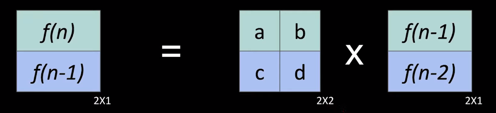
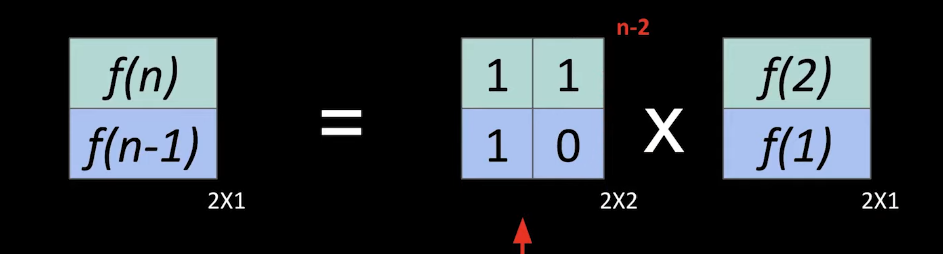

# Number Theory

### Modular Arithmetic
#### Basic +, -, *
- (a+b) % m = ((a % m) + (b % m)) % m
- (a-b) % m = ((a % m) - (b % m)) % m
- (a*b) % m = ((a % m) * (b % m)) % m
#### Modular Inverse
- b<sup>-1</sup> = b<sup>m-2</sup> % m
- (a/b) % m=  ((a % m) * (b<sup>-1</sup> % m)) % m

### Binary Modular Exponentiation
``` c++
ll pow(ll a, ll n, ll m){
    if (n==0) return 1;
    ll res= pow((a * a) % m, n/2, m) % m;
    if (n%2 == 0)
        return res;
    else
        return (a* res) % m;
}
```

### Binary Matrix Exponentiation
#### General

#### Fibonacci series


### Euclidean Algorithm
#### Computing gcd using Euclidean algorithm
``` c++
int gcd (int a, int b) {
    if (b == 0)
        return a;
    else
        return gcd (b, a % b);
}
```

#### Extended Euclidean Algorithm
``` c++
int gcd(int a, int b, int& x, int& y) {
    if (b == 0) {
        x = 1;
        y = 0;
        return a;
    }
    int x1, y1;
    int d = gcd(b, a % b, x1, y1);
    x = y1;
    y = x1 - y1 * (a / b);
    return d;
}
```

#### Linear Diophantine Equation
https://cp-algorithms.com/algebra/linear-diophantine-equation.html

### Sieve of Eratosthenes
``` c++
int n;
vector<bool> is_prime(n+1, true);
is_prime[0] = is_prime[1] = false;

for (int i = 2; i <= n; i++) {
    if (is_prime[i] && (ll)(i*i) <= n) {
        for (int j = i*i; j <= n; j += i)
            is_prime[j] = false;
    }
}
```

### Combinatorics
#### Pre computing all facts and modular inverse of facts
``` c++
class PNC {
private:
    ll m;
    ll modPow(ll a, ll n){
        if (n==0) return 1;
        ll res= modPow((a * a) % m, n/2) % m;
        if (n%2 == 0)
            return res;
        else
            return (a* res) % m;
    }

public:
    vector<ll> f;
    vector<ll> f_inv;
    // m should be a large prime number such as 1e9+7
    PNC(ll n, ll _m= 1e9+7){ 
        m= _m;
        f.resize(n+1);
        f_inv.resize(n+1);

        f[0]= f[1]= 1;
        for (ll i=2; i<=n; i++)
            f[i]= (i * f[i-1]) % m;

        f_inv[n]= modPow(f[n], m-2);
        f_inv[0]= f_inv[1]= 1;
        for (ll i=n-1; i>=2; i--) 
            f_inv[i]= ((i+1) * f_inv[i+1]) % m;
    }
    
    ll ncr(ll n, ll r){
        return (((f[n]* f_inv[n-r]) % m) * f_inv[r]) % m;
    }

    ll npr(ll n, ll r){
        return (f[n]* f_inv[n-r]) % m;
    }
};
```

#### Stars and Bars technique
The number of ways to put $n$ identical objects into $k$ labeled boxes is `nCr(n+k-1, k-1)`